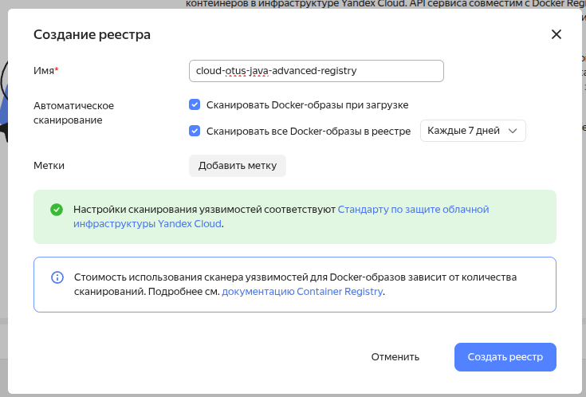

# Развертывание приложения в Yandex Cloud

## Подготовка кластера

### Создание облака
Зайти под yandex-логином https://console.yandex.cloud ; yandex предлагает создать облако - ввожу имя cloud-otus-java-advanced.

### Утилита yc
```bash
# https://yandex.cloud/ru/docs/cli/quickstart#install
curl -sSL https://storage.yandexcloud.net/yandexcloud-yc/install.sh | bash
yc init # и следуем инструкции
```

### Установка kubectl
```bash
# https://kubernetes.io/docs/tasks/tools/install-kubectl-linux/
snap install kubectl --classic
```

### Создание кластера
1. https://yandex.cloud/ru/docs/managed-kubernetes/operations/kubernetes-cluster/kubernetes-cluster-create
2. https://yandex.cloud/ru/docs/managed-kubernetes/cli-ref/cluster/create

#### Создание сети
```bash
# https://yandex.cloud/ru/docs/vpc/operations/network-create#cli_1
yc vpc network create --name otus-adv-java-net --description "Otus Java Advanced Diplom Net"
>> id: XXXXXX
```

#### Создание подсети
```bash
export NETWORK_ID=XXXX
yc vpc subnet create \
  --name test-subnet-1 \
  --description "Net subnet" \
  --network-id $NETWORK_ID \
  --zone ru-central1-d \
  --range 192.168.0.0/24
>> id <-- SUBNET_ID
```
#### Создание сервисного аккаунта
# https://yandex.cloud/ru/docs/iam/operations/sa/create
```bash
yc iam service-account create --name dimplom-k8s
done (1s)
id: ******  <-- ACCOUNT_ID
folder_id: ******    <-- FOLDER_ID
created_at: "2025-08-26T04:45:53.328978985Z"
name: dimplom-k8s

```

```bash
export FOLDER_ID=XXXXXXX
export ACCOUNT_ID=XXXXXXX
yc resource-manager folder add-access-binding $FOLDER_ID --role k8s.clusters.agent --subject serviceAccount:$ACCOUNT_ID
yc resource-manager folder add-access-binding $FOLDER_ID --role vpc.publicAdmin --subject serviceAccount:$ACCOUNT_ID

```

#### Создание container registry
Создаю container registry через GUI


```bash
# можно вывести через yc container registry list
export CONTAINER_REGISTRY_ID=XXXXX 
yc resource-manager folder add-access-binding $FOLDER_ID --role vpc.publicAdmin --subject serviceAccount:$ACCOUNT_ID
```

```
# настройка ролей доступа к сети из интернет 
#(NETROWK_ID через yc vpc network list, GROUP_ID через yc vpc security-group list ; externalIP любыми средствами (https://ipecho.net/plain))
export GROUP_ID=XXXXX
export EXTERNAL_IP=XXXX
yc vpc security-group update-rules $GROUP_ID --add-rule "direction=ingress,port=30001,protocol=tcp,v4-cidrs=[$EXTERNAL_IP/32]"
```

### Создание кластера
```
yc managed-kubernetes cluster create --name diplom-cluster --network-name otus-adv-java-net --public-ip --release-channel regular \
    --cluster-ipv4-range 10.1.0.0/16 --service-ipv4-range 10.2.0.0/16 --security-group-ids $GROUP_ID \
    --service-account-name dimplom-k8s --node-service-account-name dimplom-k8s \
    --master-location zone=ru-central1-d,subnet-id=$SUBNET_ID

# настройка kubectl
yc managed-kubernetes cluster get-credentials  diplom-cluster --external
```

### Создание ingres-сервисного аккаунта
```
# https://yandex.cloud/ru/docs/managed-kubernetes/operations/applications/alb-ingress-controller
yc iam service-account create --name diplom-ingr
yc resource-manager folder add-access-binding $FOLDER_ID --role alb.editor  --subject serviceAccount:$ACCOUNT_ID
yc resource-manager folder add-access-binding $FOLDER_ID --role vpc.publicAdmin   --subject serviceAccount:$ACCOUNT_ID
yc resource-manager folder add-access-binding $FOLDER_ID --role certificate-manager.certificates.downloader --subject serviceAccount:$ACCOUNT_ID
yc resource-manager folder add-access-binding $FOLDER_ID --role compute.viewer  --subject serviceAccount:$ACCOUNT_ID
yc resource-manager folder add-access-binding $FOLDER_ID --role smart-web-security.editor   --subject serviceAccount:$ACCOUNT_ID
yc iam key create --service-account-id $ACCOUNT_ID --output sa-key.json
# проверяем логин
cat sa-key.json | helm registry login cr.yandex --username 'json_key' --password-stdin
>> Login Succeeded
```

### Создание узлов для запуска
```
yc managed-kubernetes node-group create  --cluster-name diplom-cluster  --fixed-size 1  \
  --location zone=ru-central1-d,subnet-id=$SUBNET_ID --name diplom-group
>> id: .... <--- NODE_GROUP_ID

# доступ для скачивания образов из интернета (см базовый образ в Dockerfile)
export NODE_GROUP_ID=XXXX
yc managed-kubernetes node-group update $NODE_GROUP_ID --network-interface \
    security-group-ids=$GROUP_ID,ipv4-address=nat,subnets=$SUBNET_ID
```

## Подготовка чартов


